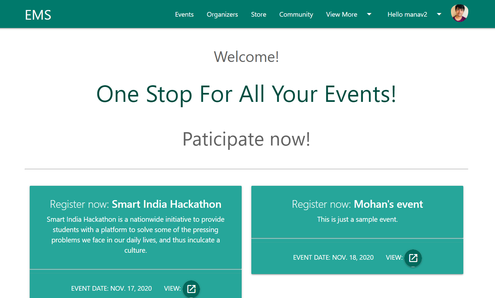

## Event Management App
___


### Introduction

This app brings together participants and event organisers in a single platform, where the organisers can post events and the participants can register.

#### How I built this?

- Django
- Materialize CSS
- Sqlite Database


#### To run the code:

Clone the repo

Run the migrations:
```python
python manage.py migrate
```

To start the development server
```
python manage.py runserver
```